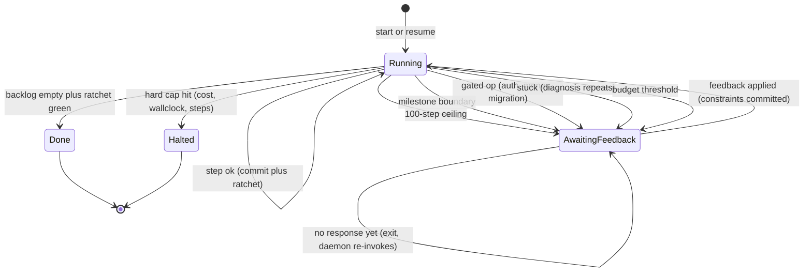

# Autonomous Build Runtime

> **NIGHT LOOP reconciliation (2026-06).** The running system is **NIGHT LOOP** on the **Claude Code Max CLI** (interactive), driven by a **Stop hook**; the real files are in `.claude/`, `scripts/night-loop.sh`, and `NIGHT-LOOP.md`. The `orchestrator/loop.ts` spine below is the conceptual model; the real loop is the Stop hook (`.claude/hooks/loop.ts`) keeping one interactive session alive while a tmux supervisor relaunches across pauses. Billing reality: only Claude Code *interactive* uses the flat Max limits; headless `claude -p` and the Agent SDK draw a separate metered credit (from 2026-06-15), and API-key agents (Pi, Aider, SDK) bill pay-go. Where this doc and the real files differ, the files win.

The autonomy shell that wraps the build loop. The build loop (inner convergence + outer milestone selection + judge stack + ratchet) is the machinery from the prior doc. This is the layer that lets it run for days, survive crashes, gate the dangerous parts, and stop every ~100 steps for durable feedback.

## Run lifecycle



## Scaffold (fits your .apsolut layout)

```
project/
  .claude/                  # skills (generator, judge, planner prompts)
  .apsolut/
    backlog.yaml            # milestones + acceptance + gated flag (the contract)
    constraints.md          # durable rules from your feedback, reloaded every plan
    decisions/              # why-we-did-it log, one file per accepted milestone
    runs/run-001/
      state.json            # RunState, resumable
      digest.md             # latest checkpoint digest (what YOU read)
      log.jsonl             # heartbeat, one line per step (tailable)
  src/                      # the product the agent builds
  harness/                  # the judge stack: tsc, lint, vitest, playwright
  ratchet/                  # growing locked suite. HARD tier (deterministic) gates every diff; ADVISORY tier (pixel/perf/LLM) informs only
    quarantine/             # specs with measured flake on unchanged code, parked until determinized (still run, cannot gate)
  orchestrator/
    loop.ts                 # the spine below
    checkpoint.ts           # digest + feedback application
    gates.ts                # what never runs autonomously
    budget.ts               # caps and rails
    flake.ts                # baseline job: re-run ratchet K times on unchanged tree, measure p, quarantine the noisy
    stuck.ts                # novelty-of-diagnosis detector
    state.ts                # load/save, crash-resumable
```

## The spine

```typescript
// orchestrator/loop.ts
import { loadState, saveState, commitAndRatchet, logDecision, type RunState } from "./state";
import { shouldCheckpoint, writeDigest, applyFeedback, pollFeedback, notifyHuman } from "./checkpoint";
import { withinBudget, recordSpend } from "./budget";
import { isStuck } from "./stuck";
import { isGated } from "./gates";
import { selectNext } from "./selector";          // outer-loop judge: what to build next
import { buildMilestone } from "../inner-loop";    // plan -> diff -> harness -> verdict (prior doc)

export async function run(runId: string) {
  const state = await loadState(runId);            // resume: reads git HEAD + state.json

  while (true) {
    if (state.status === "AWAITING_FEEDBACK") {
      const fb = await pollFeedback(runId);        // null if you haven't responded yet
      if (!fb) return;                             // unattended: exit cleanly, daemon re-invokes
      await applyFeedback(state, fb);              // feedback -> constraints.md + backlog, committed
      state.status = "RUNNING";
      state.stepsSinceCheckpoint = 0;
    }

    if (state.backlog.unmet().length === 0) return finish(state, "hero");
    if (!withinBudget(state))                return checkpoint(state, "budget_exhausted");

    const m = await selectNext(state);

    if (isGated(m)) return checkpoint(state, `gate:${m.id}`);   // auth/money/migration: never autonomous

    const result = await buildMilestone(m, state);              // the inner loop runs here
    recordSpend(state, result.cost);
    state.step += result.attempts;
    state.stepsSinceCheckpoint += result.attempts;

    if (result.ok) {
      await commitAndRatchet(state, m);            // lock the gain, git commit
      await logDecision(state, m, result);
    } else if (isStuck(state, result)) {
      await saveState(state);
      return checkpoint(state, `stuck:${m.id}`);   // don't burn days circling
    }

    await saveState(state);                        // persist EVERY step -> crash-resumable
    if (shouldCheckpoint(state)) return checkpoint(state, "scheduled");
  }
}

async function checkpoint(state: RunState, reason: string) {
  await writeDigest(state, reason);                // human-readable summary
  state.status = "AWAITING_FEEDBACK";
  await saveState(state);
  await notifyHuman(state, reason);                // push / email / or just leave digest.md
}
```

Run it under a supervisor (systemd, pm2, or a cron that re-invokes every few minutes). The loop is designed to exit cleanly and be re-entered. It never holds state only in memory.

## Contract: backlog.yaml

The single source of truth for what gets built and what counts as done. The generator and the judge both read it.

```yaml
- id: M0-harness
  depends_on: []
  gated: false
  value: 10
  acceptance:
    - "App builds with zero type errors"
    - "One smoke test passes"
    - "Headless render captures zero console errors"
    - "One screenshot baseline committed"
  rubric: null

- id: M1-tracked-domains-crud
  depends_on: [M0-harness]
  gated: false
  value: 8
  acceptance:
    - "Add domain via UI persists a row in `domains`"
    - "Domain list renders all persisted rows"
    - "Delete removes from list and table"
  rubric: null                      # deterministic, no LLM judge needed

- id: M4-auth-and-billing
  depends_on: [M0-harness]
  gated: true                       # <-- queues for you at checkpoint, never autonomous
  value: 9
  acceptance:
    - "Signup creates user; protected route 401s without session"
    - "Stripe webhook flips subscription flag"
  rubric: harness/rubrics/security-review.md
```

`gated: true` is how last turn's "seams where the harness goes blind" becomes structural. The agent plans these and stops; you approve and review the security/billing surface a human has to own.

## Safety rails: gates.ts + budget.ts

```typescript
// orchestrator/gates.ts
const SENSITIVE = {
  files:    [/auth/i, /billing/i, /payment/i, /stripe/i, /\.env/, /migrat/i, /schema/i],
  commands: [/\brm\b/, /\bdrop\b/i, /npm publish/, /git push/, /\bcurl|wget\b/, /\binstall\b/],
  milestones: ["auth", "payment", "billing", "migration", "delete"],
};

export function isGated(m: Milestone): boolean {
  if (m.gated) return true;
  return SENSITIVE.milestones.some(k => m.id.includes(k))
      || m.touchedFiles?.some(f => SENSITIVE.files.some(re => re.test(f)));
}
```

```typescript
// orchestrator/budget.ts
export const RAILS = {
  maxStepsTotal: 2000,
  maxStepsSinceCheckpoint: 100,     // <-- your "check every 100 steps"
  maxCostPerDayUSD: 50,
  maxWallClockHours: 96,            // ~4 days, hard halt
  workDirJail: "/workspace/project", // refuse any write outside this path
  networkEgress: "deny-by-default",  // allowlist only (your nftables instinct applies here)
  commandTimeoutSec: 120,
};
```

Run the whole thing in a container or VM, not on your daily-driver machine. An agent with shell access running unattended for days is exactly the threat model this design assumes. Git is the recovery net: every accepted step is a commit, the run can hard-reset to any checkpoint, nothing irreversible happens between commits.

## Durable feedback: checkpoint.ts

```typescript
// orchestrator/checkpoint.ts
export async function applyFeedback(state: RunState, fb: Feedback) {
  // fb.directives: structured ("deprioritize M7", "stop using lib X", "approve M4")
  // fb.freeText:   parsed by one small LLM call into constraints + backlog edits
  for (const c of fb.newConstraints) appendTo(".apsolut/constraints.md", c);  // reloaded EVERY plan
  for (const e of fb.backlogEdits)   applyTo(state.backlog, e);
  if (fb.rubricChanges) updateRubric(fb.rubricChanges);
  if (fb.approveGated)  state.backlog.ungate(fb.approveGated);                 // your explicit go-ahead
  commit(`feedback @ step ${state.step}`);                                    // durable, versioned
}
```

The line that matters: feedback writes to `constraints.md`, and the planner loads `constraints.md` on every iteration. Without that reload, your note evaporates and you re-give it next checkpoint. With it, "fix the date filter, stop adding new libs, deprioritize the landing page" sticks for the rest of the run.

## What you read: digest.md

The checkpoint writes this so your review is async and 60 seconds, not an archaeology dig.

```markdown
# Run 001 - Checkpoint (step 412, reason: gate:M4-auth-and-billing)

## Since last checkpoint (steps 300-412)
- M3 composition: DONE. 4 panels, grid responsive. Snapshot baseline set.
- M2 chart: DONE. Revenue series asserted against seeded data.

## Ratchet
- 47/47 green. No regressions.

## Blocked / needs you
- M4 (auth + billing) is GATED. Planned approach attached below. Approve, redirect, or defer.
  Risk surface I did NOT auto-test: session fixation, webhook idempotency, cross-tenant IDOR.

## Next if you approve
- M5 live data, then M6 edge states.

## Open questions
- Ingestion (M7) has no real data source defined. Will stall here. Decision needed.
```

Notice it surfaces the stuff the harness cannot see and asks rather than guessing. That is the gate doing its job.

## Crash recovery

A multi-day run will crash: API errors, rate limits, a reboot. Resumability is not optional.

- State persists after every step (git commit + `state.json` write).
- On restart, `loadState` reads the last commit and `state.json` and continues from the exact point.
- Every step is idempotent: safe to re-run if the process died mid-step (apply diff is git-backed, commit is the only state mutation).
- This idempotence has a precondition the prior doc hides: the harness must be *deterministic*, not merely pure. A non-deterministic harness can return a different verdict on the re-run than it gave before the crash, so resume is no longer the same step. The determinization checklist in `judge-and-flake-reliability.md` (fixed clock, seeded RNG, pinned fonts/Chromium, state waits not time waits) is what makes "re-run is safe" actually true, and it is the same work that keeps the ratchet trustworthy.

## Build order

Do not build the product first. Build the runtime that builds the product, smallest viable version, then let it run.

1. `state.ts` + `loop.ts` skeleton that does nothing but count steps and checkpoint at 100. Prove the lifecycle and resume work.
2. `harness/` with M0 only: build + one smoke test + one screenshot. Prove the judge produces real signals.
3. `buildMilestone` (inner loop) wired to your generator/judge subagents. Prove one milestone goes green and ratchets.
4. `gates.ts` + `budget.ts`. Prove a gated milestone stops and a budget cap halts.
5. `checkpoint.ts` feedback path. Prove your note lands in `constraints.md` and changes the next plan.
6. Fill `backlog.yaml` with the real ladder. Start the daemon. Check `digest.md` when it pings you.

Steps 1 to 5 are a day or two of building. After that the system builds the product and you review digests. The leverage is entirely in steps 1 to 5 being solid, because a flaky runtime fails silently over days and you lose more time than you saved.
