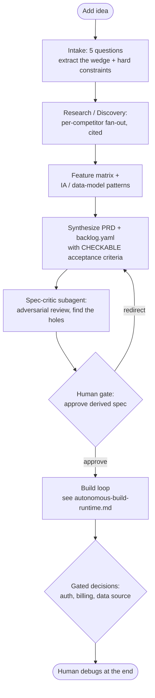

# Idea to Product Pipeline

> **NIGHT LOOP reconciliation (2026-06).** This is NIGHT LOOP's *front half* (intake to a checkable spec). The *back half* (the build loop) is implemented per `NIGHT-LOOP.md` on the Claude Code Max CLI plus a Stop hook. The research phase may use the Tavily and Perplexity APIs for grounded deep research (see below); those are metered on their own keys and sit on the container egress allowlist, independent of the Claude billing.

The other docs build the *back half*: a spec goes in, the loop (generator, judge, ratchet,
gates) turns it into a tested product inside a jail. This doc is the *front half*: an idea
goes in, five questions get answered, and the AI researches how established products solve
the category and emits the spec the loop then executes. The point is to delete the
hand-written PRD. Today a human writes "analytics dashboard, M0 to M11." Here the human
gives an idea and a wedge, and the research phase writes the milestones.

Scope: single-user. You feed it your own ideas. No multi-tenancy, accounts, or billing
for the platform itself (the *products it builds* may have those, gated as usual).

## The pipeline

The human touches this **once at the start** (approve the spec), at the **gates** during
the run (the decisions research cannot make), and **once at the end** (debug). Everything
between is automated. That is the "code for a couple days, near-full automation" target.

## Reuse, do not rebuild

Most of the safeguards and state this idea wants already exist. Build only the front half.

| Want | Already in the repo |
|---|---|
| Isolated env: AI can mkdir, delete, evolve | `autonomous-build-runtime.md` budget.ts `RAILS` (workDirJail, network deny-by-default), git as undo |
| "Trello mind" TODO / DOING / DONE | `.apsolut/progress.md` (Done/Doing/Next/Blocked/Deferred/Discovered) |
| Judges on each step | `.claude/agents/judge.md` + the ratchet + `judge-and-flake-reliability.md` |
| Stop at decisions a human owns | the `PreToolUse` gate hook + PRD Section 7 gates |
| Workflows / subagents | generator-vs-judge split, the Stop-hook loop (`.claude/hooks/loop.ts`) |

## Intake: the five questions

Keep it to what only the human knows and research cannot produce. Everything else is
researched, not asked.

1. **Idea in one line.** What is it.
2. **The wedge.** Why this instead of the incumbent (Linear, Attio, Semrush, Trello, ...).
   A pure clone has no reason to exist, and no amount of research will invent this. This
   is the single most important answer.
3. **The one user and the one job.** Who is it for and the single job it must nail first.
4. **Hard constraints.** Stack pins, budget, must-have or must-not integrations, anything
   non-negotiable. (These seed `constraints.md`.)
5. **The ground-truth seams.** Where does real data come from, is there money, is there
   anything irreversible. These are flagged gated up front so the loop stops there instead
   of guessing (this is PRD M9 made a first-class question).

## Research / Discovery (automated, grounded, cited)

This is a Workflow, not a single prompt. Fan out, synthesize, criticize. Use real deep-research APIs for grounding rather than ad-hoc scraping: Tavily (agent-optimized search) and Perplexity Sonar (multi-step research with citations). They are metered on their own keys, sit on the container egress allowlist (`api.tavily.com`, `api.perplexity.ai`), and are independent of the Claude billing, so research cost is decoupled from the build.

- **Per-competitor agents.** One agent per reference product. Each returns a structured
  read of feature set, information architecture, core flows, and the data-model shape it
  implies. Sourced, not asserted.
- **Synthesize a feature matrix.** Columns are the reference products, rows are
  capabilities. The intersection of the commonly-shipped capabilities, filtered through
  the wedge and the one-job answer, is the MVP slice.
- **Completeness critic.** A final agent asks what is missing: a modality not searched, a
  capability claimed with no source, a flow nobody actually verified.

Treat this exactly like the LLM judge in `judge-and-flake-reliability.md`: research is a
fuzzy, hallucination-prone input. Every "product X does Y" must cite a real source. An
unsourced claim is the spec-level version of a false green, and the cost is days of
perfectly built code on a fabricated premise. Ground it, then let the human glance once.

## Spec synthesis (the crux)

The research phase's real output is not prose. It is `backlog.yaml`: milestones in
dependency order, each with **behavioral, seed-checkable acceptance criteria**. "Build it
like Attio" is not a test. "The pipeline view groups deals by stage and the count per
column equals the seeded rows in that stage" is. If the spec is vibes, the whole judge and
ratchet stack has nothing to bite, and you get the hollow product one level up.

Rules the synthesizer obeys (all inherited from the existing docs):

- Every criterion is checkable against ground truth (seeded data), not "implemented."
- M0 (harness) is always first; nothing is verifiable without it.
- The slice is an MVP ladder, not the incumbent's full product. Semrush is fifteen years
  of engineering; the backlog targets the one job, then extends. Scope discipline is what
  keeps the loop terminating.
- Gated milestones (auth, billing, data source, anything irreversible) are marked gated
  here, so the loop plans them and stops rather than building over a hole.

## The decision taxonomy: auto-resolve vs gated

"We do not ask the human, we do what the established players do" is correct for the
commodity 80% and a trap for the novel 20%. The dividing line is whether research can
answer it.

| Auto-resolve by research (no human) | Gated (human owns it) |
|---|---|
| CRUD shapes, list/detail/empty/error states | The wedge and positioning |
| Dashboard layout, IA, navigation patterns | Where real data comes from (M9) |
| Auth *flow* shape, settings patterns | Billing semantics and money movement |
| Common feature set for the category | Anything irreversible (migrations, deletes, publishes) |
| Naming and structure conventions for the stack | Legal, brand, proprietary copy |

The rule is not "never ask the human." It is: **ask once at the spec gate, and during the
run only about what research provably cannot settle.** Same gate machinery as PRD Section
7, triggered one layer earlier (at the spec) as well as during the build.

## Where the Max features fit

- **Workflow**: the Research/Discovery phase (per-competitor fan-out, matrix synthesis,
  completeness critic) and the spec-critic pass before the human sees the PRD.
- **Subagents**: research agents, a spec-critic that adversarially reviews the derived
  backlog, plus the existing generator/judge split for the build.
- **Ultrathinking**: spend it on spec synthesis and the auto-vs-gated classification, the
  two highest-leverage and least mechanical steps. Not on the loop.

## Failure modes and guards

| Failure mode | Symptom | Guard |
|---|---|---|
| Hallucinated research | Days of code on a premise no competitor actually ships | Cited sources + feature matrix + the one human spec gate |
| Spec-level false green | "Built like Linear" passes because the criterion was prose | Acceptance criteria are behavioral and seed-checkable, or they do not count |
| Clone with no reason to exist | A worse copy of the incumbent | The wedge question is mandatory; the synthesizer must honor it |
| Scope explosion | Loop never terminates, "do everything Semrush does" | MVP ladder discipline; the backlog targets the one job first |
| Auto-resolving a gated call | Agent guesses the data source or billing rule | The decision taxonomy; gated classes never auto-resolve |

## The one-line version

The loop already builds a product from a spec inside a jail. This front half deletes the
hand-written spec: the human gives an idea and a wedge, research turns "how the established
players do it" into checkable acceptance criteria, and the only human touch before days of
building is one glance at the derived spec. Do what others do for the commodity 80%; gate
the human exactly on the 20% research cannot invent.
