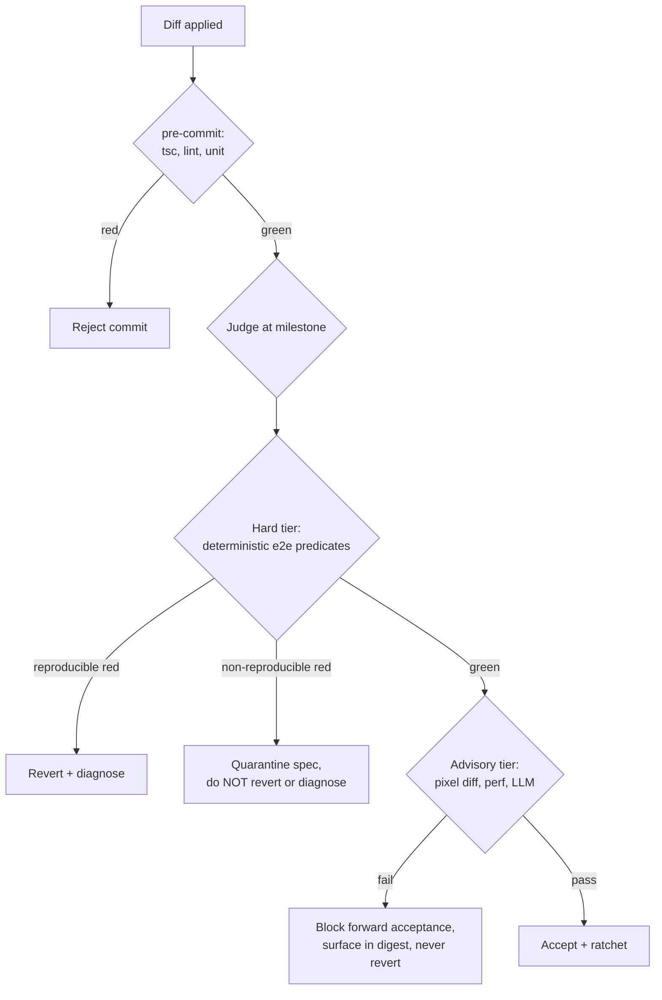

# Judge and Flake Reliability

> **NIGHT LOOP reconciliation (2026-06).** This underpins NIGHT LOOP's judge. The Stop hook's done-verification (`.night-loop/hooks/loop.ts`) and the `night-loop-judge` subagent (`.claude/agents/night-loop-judge.md`) both rely on the hard-vs-advisory tier split and the reproducibility rule defined here. Still fully current.

The prior docs build the loop (inner convergence, outer selection), the judge stack, the
ratchet, and the autonomy shell. All of it rests on one assumption that none of them
state: that a red test means the diff broke something. This doc makes that assumption
explicit, shows where it fails, and gives the rules that keep the ratchet trustworthy.

The one-line version up front: the ratchet's promise ("progress is monotonic, the green
count only goes up") is enforced by "revert any diff that reds a green test." That rule
produces monotonic progress only if a red is *caused by the diff*. The moment a test is
non-deterministic, a red can be caused by noise, and the revert throws away good work
while the diagnosis lies to the planner. Objective is not the same as deterministic, and
the difference is the whole ballgame.

## The load-bearing math: flake cost scales with ratchet size

With per-test flake probability `p` and `N` noisy specs in the ratchet, the probability a
*clean* run (no real regression) comes back fully green is about `(1-p)^N`. So the
probability of at least one spurious red is `1 - (1-p)^N`. The ratchet is *designed to
grow*: every accepted milestone adds specs, forever. N is the success metric. Which means
the spurious-red rate climbs precisely as the build succeeds.

| p (per spec) | N=20 | N=50 | N=100 | N=200 |
|---|---|---|---|---|
| 0.1% | 2.0% | 4.9% | 9.5% | 18% |
| 0.5% | 9.5% | 22% | 39% | **63%** |
| 1.0% | 18% | 39% | 63% | 87% |

Read the 0.5% row: that is a *good* Playwright flake rate, and by 200 specs almost
two-thirds of clean diffs get falsely reverted. The mechanism fights its own success. A
per-spec flake rate that looks harmless on day one is fatal at "hero" scale. This is not
an implementation bug to fix later. It is a structural property that dictates the rules
below.

## Two failure directions, both corrosive

- **False revert (loud).** An unrelated flaky spec reds on this run. A good diff is
  reverted. Worse, the failed verdict's diagnosis (the inner loop's `lastFailure`, the
  judge's REJECT reason) says "you broke spec X." The best idea in the prior docs ("the
  plan reads `lastFailure`") becomes a vector for misinformation: the planner now
  optimizes against a regression that never happened. Flake does not just cost a diff. It
  poisons the learning loop.
- **False green (silent, worse).** A spec that *should* catch a real regression passes by
  luck on the acceptance run. The milestone ratchets in. The digest line "47/47 green, no
  regressions" is now a lie, and the human approves on a false signal. This is reward
  hacking arriving by accident through a door the design left open.
- **Resume is not actually idempotent (quiet).** `autonomous-build-runtime.md` claims
  "every step is idempotent, the harness is pure." A non-deterministic harness is not
  pure: a re-run after a crash can yield a different verdict than the pre-crash run.
  Determinism is therefore a precondition for the crash-recovery guarantee, not only for
  the ratchet.

## The layers are not equally deterministic

The judge stack is treated as a uniform green/red oracle. It is not. Objective predicate
(the check computes a real value) and deterministic measurement (the value does not wobble
run to run) are different properties, and the layers split on exactly that line.

| Layer | Determinism | Note |
|---|---|---|
| 0 build / `tsc` | Deterministic | Trustworthy. Gate freely. |
| 1 lint | Deterministic | Trustworthy. |
| 2 unit tests (pure logic) | Deterministic | The real, safe ratchet. |
| 3 console-error capture | Noisy | Hydration and third-party warnings, async timing. |
| 4 DOM / data assertion | Predicate deterministic, **wait** noisy | `value == computed-from-seed` is solid; flake is in the *waiting*, not the assertion. |
| 5 screenshot pixel diff | **Very noisy** | Anti-aliasing, font hinting, sub-pixel layout, animation frames, caret blink, scrollbars, GPU/OS. A threshold-magic-number fuzzy judge in disguise. |
| 6 perf timing | Noisy | Wall-clock varies with machine load; bundle size is fine, render timing is not. |
| 7 LLM judge | Non-deterministic by construction | Sampling, prompt sensitivity, cross-version drift. |

The fix starts here: only deterministic layers may auto-revert. Everything else informs
but never reverts already-green work.

## Two tiers, two times

The starter kit already gets half of this right, and the rules below keep it and extend
it. There are two enforcement points, and they must carry different tiers.

- **Commit time (the `pre-commit` hook): hard tier, deterministic only.** Run `typecheck`,
  `lint`, `test:unit`. Nothing noisy. This is already what `.githooks/pre-commit` does,
  and it is correct: a commit that reds a deterministic gate is rejected, and that gate
  never falsely fires. Keep the noisy layers out of the commit path.
- **Acceptance time (the judge): hard tier = deterministic e2e predicates only; the rest
  is advisory.** The deterministic predicate of a DOM/data assertion ("the number on
  screen equals the number computed from the seed", evaluated after a correct state wait)
  may hard-reject. Screenshot pixel diff, perf timing, and the LLM rubric are advisory:
  they can block a milestone's *forward* acceptance and they surface in the digest, but
  they never trigger a *revert* of already-green work. A revert on a noisy signal destroys
  real progress, and that path must be closed.

## The one non-negotiable rule: reproducibility gating

Never revert, and never emit a `lastFailure` or judge REJECT, on a red that is not
reproducible.

A red counts only if it **fails on retry on the new diff AND passed on the unchanged
baseline.** That is the definition of "the diff caused it." Anything else is noise wearing
a regression's clothes, and acting on it is what makes the loop thrash against its own
test suite. Retry here is for *classification*, never for going green: a spec that
fails-then-passes is *flaky*, which is itself a defect to quarantine, not a success to
bank. Retry-to-green is the trap that manufactures false greens.

## Determinization checklist

The hard tier is only trustworthy if its specs are actually deterministic. This is the
unglamorous prerequisite, and it is also what makes the runtime's "harness is pure"
crash-recovery claim true. Apply all of it before trusting any e2e spec to gate:

- **Freeze time.** Inject a fixed clock; mock `Date`/`now`. Any time-based rendering is
  then stable.
- **Freeze randomness.** Seed every RNG.
- **Kill motion.** Disable animations and transitions in the test build
  (`* { animation: none !important; transition: none !important }`, honor
  `prefers-reduced-motion`).
- **Pin fonts.** Bundle web fonts locally, await `document.fonts.ready`, and run in a
  container with pinned fonts and a pinned Chromium. This is a second reason for the
  container beyond security.
- **Stabilize layout.** Fixed viewport, hide scrollbars, mask dynamic regions
  (timestamps, generated ids) in any screenshot via Playwright `mask`.
- **Wait on state, never on time.** Ban `waitForTimeout`. Require `expect.poll`,
  `toPass`, or explicit element/state waits. This single ban removes most layer 3 and 4
  flake.
- **No real network.** Stub everything against seeded fixtures.

## Flake quarantine and the baseline job

You cannot drive `p` to exactly zero, so you measure it and quarantine what fails.

- **Baseline job.** Periodically re-run the whole ratchet `K` times against the *same*
  commit (no diff). Any spec that is not green all `K` times has nonzero flake on
  unchanged code and is moved out of the hard tier into a `quarantine` bucket until fixed.
  This gives you the real `p` to plug into the table above and a tripwire when flake
  creeps up over a multi-day run.
- **Quarantine, do not delete.** A quarantined spec still runs and still reports; it just
  cannot hard-reject. Fixing it (usually a determinization miss) returns it to the hard
  tier. This is distinct from "never delete or weaken a test": quarantine weakens nothing,
  it relocates an untrustworthy signal until it is trustworthy.

## Honest visual judge

Screenshot pixel diff is a fuzzy judge with a magic-number threshold, and the prior docs
mislabel it objective. Treat it honestly:

- For *regression detection*, prefer asserting computed layout geometry (element
  `boundingBox` positions and sizes). Geometry is far more deterministic than pixels and
  catches the cases that matter (something moved, overlapped, or collapsed) without pixel
  noise. Put geometry assertions in the hard tier.
- Reserve masked pixel diff, with a threshold set *above the measured noise floor* from
  the baseline job (not a guessed number), for the advisory tier.
- A tripped pixel diff escalates to the human or the LLM judge. It never auto-reverts.

## Reliable LLM judge

The LLM judge is non-deterministic by construction, so it can never sit in the hard tier;
it is strictly advisory (in the starter kit it is the M11 landing rubric only). To make
its advisory verdict worth anything:

- **Pin and freeze.** Temperature 0 and a pinned model id. A model upgrade silently shifts
  the verdict distribution and drifts across a multi-day run; treat a bump as a rubric
  change requiring re-baseline.
- **Structure the output.** Per-criterion PASS/FAIL with cited evidence, not a vibe score.
- **Quorum.** Run the judge `k` times (or with `k` distinct lenses). A split verdict
  escalates to the human rather than passing or failing unilaterally.
- **Calibrate offline.** Keep a small golden set of pre-labeled good and bad screenshots
  and confirm the judge agrees with the labels before trusting it on novel input. A judge
  that cannot pass its own calibration set is emitting noise. This is the generator-side
  principle ("ground the judge in something the generator cannot trivially satisfy")
  applied to the judge itself: ground it in something *noise* cannot trivially flip.

## Flake-budget SLO

Pick a maximum acceptable spurious-red probability per run, for example 2%. Given the
measured `p` from the baseline job, the table above bounds how many flaky-class specs may
sit in the hard tier, which forces the quarantine discipline. If the hard tier truly
reaches `p` near zero (deterministic layers plus determinized geometry/data predicates),
it can grow unbounded safely, and that is the whole point: determinism is what lets the
ratchet scale to "hero" without strangling itself.

## The one-line version

The prior docs nail that the judge must be grounded in something the *generator* cannot
trivially satisfy. The missing dual is just as important: the judge must be grounded in
something *noise* cannot trivially flip. Until the harness is determinized and the ratchet
is split into a reproducible hard tier and an advisory tier, "monotonic progress" is a
claim the substrate cannot back, and it breaks down precisely as the run succeeds.
