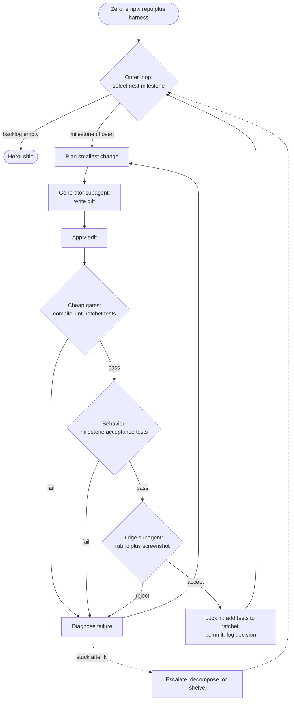

# Zero-to-Hero Agentic Build Loop

> **NIGHT LOOP reconciliation (2026-06).** This is the conceptual core of **NIGHT LOOP**, implemented on the **Claude Code Max CLI** (interactive) driven by a **Stop hook** (real files in `.claude/`, `scripts/night-loop.sh`, `NIGHT-LOOP.md`). The Substrate notes below favor the Claude Agent SDK; the project chose the Claude Code Max CLI plus a Stop hook instead, because only *interactive* Claude Code uses the flat Max limits (the SDK and headless `claude -p` draw a separate metered credit from 2026-06-15). The two-loop model, judge stack, and ratchet here all still hold; see also `judge-and-flake-reliability.md`.

An agent that codes a dashboard from nothing to feature-complete-and-optimized, autonomously, in loops. The loop mechanics are trivial. The thing that makes it *converge* instead of *thrash* is the judge and the ratchet. This document is mostly about those.

## The core reframe: two loops, not one

A single "generate -> run -> repeat" loop is a generator with no selector. It will produce something that compiles and declare success. To get zero-to-hero you need two nested loops with two distinct objective functions:

- **Inner loop (convergence):** make *one* change correct. Generate the smallest diff, verify, fix, until acceptance passes or budget runs out.
- **Outer loop (curriculum / extension):** decide *what capability to build next*, lock in gains, decide when "hero" is reached.

Optimization is a third mode that reuses the inner loop with a different judge (see below). Extension adds behavior; optimization improves the *same* behavior. Conflating them is how agents "optimize" by quietly deleting features.

## Loop topology



## Inner loop (convergence)

```typescript
async function buildMilestone(m: Milestone, state: RepoState, budget: Budget) {
  let lastFailure: Diagnosis | null = null;
  let attempts = 0;

  while (attempts < budget.maxAttempts) {
    const plan = await planner(m, state, lastFailure);   // what to change, why, where
    const diff = await generator(plan, state);           // smallest blast radius
    apply(diff);

    const signals = await harness.run(state);            // see "judge stack" below
    const verdict = judge(signals, m.rubric);

    if (verdict.regressedRatchet) {                      // set only on a REPRODUCIBLE hard-tier red
      revert(diff);                                      // NEVER accept a reproducible regression
      lastFailure = { kind: "regression", detail: verdict.brokenTests };
    } else if (verdict.passed) {
      return { ok: true, diff };
    } else {
      lastFailure = verdict.diagnosis;                   // feeds the next plan
    }
    attempts++;
  }
  return { ok: false, lastFailure };                     // hand back to outer loop
}
```

Two non-negotiables hide in here:

1. **The plan reads `lastFailure`.** A loop that re-plans from scratch each iteration ignores what it just learned and oscillates. The diagnosis from the failed verdict is the most valuable input to the next plan.
2. **Revert on a *reproducible* regression, always.** This is what makes progress monotonic. The qualifier matters: a red caused by flake (a non-deterministic spec, not the diff) must not trigger a revert, or the loop thrashes against its own test suite and the diagnosis fed to the next plan is a lie. A red counts only if it fails on retry on the new diff AND passed on the unchanged baseline. See `judge-and-flake-reliability.md`.

## Outer loop (curriculum / extension)

```typescript
async function zeroToHero(backlog: Milestone[], state: RepoState, budget: Budget) {
  while (budget.remaining() && backlog.hasUnmet()) {
    const m = selector.pickNext(backlog, state);   // judge-first applied to WHAT, not just whether
    const result = await buildMilestone(m, state, budget.perMilestone());

    if (result.ok) {
      ratchet.add(m.acceptanceTests);              // lock the gain in forever
      commit(state, m.id);
      logDecision(m, result.diff);                 // so the loop never re-litigates
    } else {
      escalate(m, result.lastFailure);             // decompose into smaller milestones, or shelve
    }
  }
  return state;                                    // "hero"
}
```

`selector.pickNext` is the outer-loop judge. Cheapest useful version: topologically sorted backlog (dependencies first), break ties by value. Smarter version: an LLM call that scores unmet milestones against current state and risk. Either way, the agent is never choosing work arbitrarily.

## The judge stack (cheap to expensive, fail fast)

Run deterministic gates first. Only spend the expensive fuzzy judge once the cheap gates are green. No point asking "is it usable" about something that does not compile.

| Layer | Signal | Cost | What it catches |
|---|---|---|---|
| 0 | Type check / build (`tsc`, bundler) | ~s | Does it exist and compile |
| 1 | Lint / format (`eslint`, `prettier`) | ~s | Style and obvious smells |
| 2 | Unit tests (data transforms, logic) | ~s | Correctness of pure logic; **this is the ratchet** |
| 3 | Headless render + console error capture (Playwright) | ~10s | Runtime crashes, blank screens |
| 4 | DOM / integration assertions (Testing Library, Playwright) | ~10s | "The metric actually shows the right number" |
| 5 | Layout geometry (boundingBox) + visual snapshot diff (Playwright) | ~10s | Layout regressions. Prefer deterministic geometry assertions for the gate; treat raw pixel diff as advisory (it is noisy, see below) |
| 6 | Perf budget (bundle size, render timing, Lighthouse) | ~min | Bloat, slow paint |
| 7 | LLM-as-judge on screenshot + rubric | ~$ | UX quality, "looks like a real dashboard for X" |

Layers 0 to 6 are objective and feed back as structured failures the planner can act on. But objective is not the same as deterministic: layers 0 to 2 (and the *predicate* of a 4-style data/geometry assertion) are deterministic and safe to auto-revert on; layers 3, 5, 6 are objective yet noisy (timing, anti-aliasing, machine load) and must not auto-revert, or flake makes the ratchet thrash. Layer 7 is fuzzy by construction. The split matters more as the ratchet grows: with per-spec flake `p` and `N` specs, the odds of a spurious red on a clean run are `1 - (1-p)^N`, which climbs as the build succeeds. Keep the auto-revert tier deterministic and the noisy layers advisory; keep layer 7's rubric versioned and pinned. The full treatment is in `judge-and-flake-reliability.md`.

The crux: **your judge must be grounded in something the generator cannot trivially satisfy.** "Does it compile" is satisfiable by an empty component. "The revenue panel renders the sum of the seeded rows and the screenshot diff is under threshold" is not. Weak judge = reward hacking = the hollow dashboard. This is the entire failure mode in one sentence.

## The ratchet (anti-thrash, monotonic progress)

A growing manifest of tests that must *all* stay green. Every accepted milestone contributes its acceptance tests to it. The inner loop reverts any diff that reds the hard tier on a reproducible failure (the tier and reproducibility rules are spelled out just below). Properties this buys you:

- Progress is monotonic. The green-test count only goes up.
- Fix-A-breaks-B oscillation is impossible (breaking B fails the ratchet, diff reverts).
- "Done" is measurable: backlog empty AND ratchet 100% green.

The ratchet has two tiers, and only one of them auto-reverts. The **hard tier** is the deterministic specs (build, lint, unit, and the data/geometry *predicate* of e2e assertions); a reproducible red here reverts the diff. The **advisory tier** is the noisy layers (pixel diff, perf, the LLM rubric); these can block a milestone's forward acceptance and surface in the digest, but they never revert already-green work. This split is not optional: auto-reverting on a noisy signal turns the anti-thrash mechanism into a thrash generator. And the revert is gated on reproducibility (fails on retry on the diff AND was green on the unchanged baseline); a non-reproducible red is flake and is quarantined, never reverted. See `judge-and-flake-reliability.md`.

Without a ratchet, long loops drift and silently regress earlier work. With it, the codebase plus the ratchet *is* the durable state, which also solves context rot: each iteration reloads minimal context (current diff target plus decision log plus failing signals), not a bloated transcript.

## Extension vs optimization (two judges, never one)

| | Extension judge | Optimization judge |
|---|---|---|
| Objective | New capability works | Same behavior, better metric |
| Tests | Additive (new acceptance test) | Behavior held constant via ratchet |
| Target metric | Pass / fail | Perf, bundle size, LOC, duplication, a11y score |
| Failure if absent | Nothing gets built | Agent "optimizes" by removing features |

Optimization runs the inner loop with the full ratchet as a hard constraint and a scalar metric to minimize. The behavior cannot change (ratchet); only the number improves. This is the only safe way to let an agent refactor autonomously.

## Zero-to-hero capability ladder (dashboard)

Each rung is a milestone with its own acceptance test. It ships only when its test is green and the ratchet is still green. M0 first, always, because the harness is what makes every later rung verifiable.

- **M0 Harness.** Empty app builds, renders "hello", one passing unit test, one screenshot baseline, headless run captures console errors. *This is the eval-first foundation. Build it before any feature.*
- **M1 One real metric** from the real data source, rendered, asserted against seeded data.
- **M2 One chart** (second view), data-bound and asserted.
- **M3 Composition.** Multiple panels in a layout; snapshot baseline for the grid.
- **M4 Interactivity.** Filters / date range; assert the displayed data changes correctly on input.
- **M5 Live data.** Polling or stream; assert refresh updates the view; assert stale-while-revalidate behavior.
- **M6 Edge states.** Loading, empty, error. The states agents skip. Assert each renders without crashing and shows the right affordance.
- **M7 Optimization pass.** Perf budget, bundle, a11y. Behavior frozen by ratchet, metrics improved.
- **M8 Polish pass.** LLM-judge UX rubric drives small refinements. Last, because it is the fuzziest and cheapest to regress.

## Failure modes and guards

| Failure mode | Symptom | Guard |
|---|---|---|
| Reward hacking | "Done" but hollow | Judge grounded in behavior/data, not existence of code |
| Thrashing / oscillation | Fix A breaks B, repeat | Hard-tier ratchet + revert on a reproducible regression |
| Flake-induced thrash / false greens | Good diffs reverted on noise; or a lucky pass ratchets a hollow milestone | Deterministic hard tier, advisory noisy tier, reproducibility gate, flake-baseline + quarantine (`judge-and-flake-reliability.md`) |
| Context rot | Forgets decisions, re-litigates over many iterations | Codebase + decision log as state; reload minimal context per iteration |
| Aimless wandering | Builds arbitrary things | Outer-loop selector with prioritized backlog |
| Never terminates | Gilds the lily forever | Roadmap-level definition of done + per-mode budget caps |
| Stops too early | Quits on first hard milestone | Stuck detection -> decompose into smaller milestones before shelving |
| Generator grades itself | Inflated verdicts | Separate generator and judge contexts |

Stuck detection: no improvement in the green-test delta after N inner-loop attempts. On stuck, the outer loop decomposes the milestone into smaller ones (a planning move) rather than retrying the same thing, and only shelves after decomposition also fails.

## Substrate notes

- **Substrate: Claude Code Max CLI plus a Stop hook** (the project's choice; see `NIGHT-LOOP.md`). The Stop hook is the inner-and-outer loop: it runs the harness each turn and forces continuation until done. This keeps the run on the flat *interactive* Max limits. The **Claude Agent SDK** is also a clean fit technically (tools for read/write file, run command, run tests, screenshot) but bills against the separate metered Agent SDK credit (from 2026-06-15) rather than the flat interactive limit, so it is the fallback for uninterrupted runs, not the default.
- **Separate the roles.** Generator subagent (writes diffs, sees the plan and codebase) and judge subagent (sees spec + artifact + signals, *not* the generator's reasoning). Same model is fine; separate context is the point. The judge must not see the generator's justifications or it adopts them.
- **Git as state.** Commits are checkpoints, the diff is the unit of work, revert is free. Branch per milestone if you want safe experimentation.
- **Persistent memory** (a persistent procedural-memory tier): "approaches that worked / failed for this kind of milestone" carried across sessions so the agent does not relearn the same lesson on every cold start.
- **Decision log** (`decisions/`): every accepted milestone writes why-we-did-it. This is what keeps a 50-iteration run from re-litigating settled choices.

## The one-line version

The loop is plumbing. The product is the judge. You already build the generator half every time and skip the selector. Here the selector shows up twice: as the outer-loop *what to build next*, and as the judge stack *whether the build is real*. Build M0 and the ratchet first. Everything else is gravy that the harness can actually verify.
